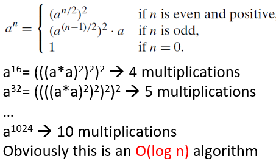

 # <!-- fit --> IEEEXTREME Competition Training 

## Dr. Khalil Chebil 
### <k.chebil@psau.edu.sa>
---
# Content
- Problem Solving Challenge
- Problem Solving Techniques
- Practice Problems
  - Computing $a^n$
  - Maximum Subsequence Problem
---
# Problem Solving Challenge
>- Hard to design algorithms that are 
    - Correct 
    - Efficient 
    - Implementable
>- Need to know about
    - Design and modeling techniques
    - Resources - don't reinvent the wheel

----
#
# Problem Solving Techniques

- **Brute Force & Exhaustive Search**: Try all possibilities 

- **Divide & Conquer**: break problem into distinct subproblems

- **Decrease & Conquer**: solve a smaller instance of the problem 

- **Dynamic Programming**: break problem into overlapping subproblems 

- **Greedy Algorithms**: repeatedly do what is best now

- **Transform & Conquer**: convert problem to another one

- **Iterative Improvement**: repeatedly improve current solution


----
# Practice Problems: Computing $a^n$ 
>Iterative Solution :
Multiply 1 by a n times.  
```java
int pow(int a, int n){
    int res=1;
    for(int i=0;i<n;i++)
        res*=a;
    return res;
}
```
$$Complexity ~ O(n)$$
----
#  Practice Problems: Computing $a^n$ (cont.)
>Recursive Solution 
  $a^n = a \times a^{n-1}$
```java
int pow(int a, int n){
    if(n==0)
      return 1;
    return a*pow(a,n-1);
  } 
```
$$Complexity ~ O(n)$$
----
#  Compute $a^n$ (cont.)
> Decrerase and conquer Solution
```java
int pow(int a, int n){
    if(n == 0)
      return 1;
    if(n == 1)
      return a;
    if(n % 2 == 0){
      int m=pow(a,n/2);
      return m*m;
    }  
    return a*pow(a,n-1);
}
```


----
# Practice Problems: Maximum Subsequence Problem
Given (possibly negative) integers $A_1, A_2,\dots, A_N$, find the maximum value of
$$\sum_{k=i}^{j} A_k$$
For convenience, the maximum subsequence sum is zero if all the integers are negative.
- Example: input -2, 11, -4, 13, -5, -2
  - The answer is 20 ($A_2$ through $A_4$)

----
#
# Practice Problems: Maximum Subsequence Problem
$$Brute~force~ O(N^3)$$
```java
int maxSubSum(int[]a){
    int maxSum = 0; 
    for( int i = 0; i < a.length; i++ ) 
        for( int j = i; j < a.length; j++ ) 
        { 
            int thisSum = 0; 
            for( int k = i; k <= j; k++ ) 
                thisSum += a[ k ]; 
            if( thisSum > maxSum )
                maxSum = thisSum; 
        } 
    return maxSum; 
  }
````
----
#
# Practice Problems: Maximum Subsequence Problem
$$Optimized~Brute~force~ O(N^2)$$
```java
int maxSubSum(int[]a){
  int maxSum = 0; 
  for( int i = 0; i < a.length; i++ ) 
  { 
    int thisSum = 0; 
    for( int j = i; j < a.length; j++ ) 
    { 
      thisSum += a[ j ]; 
      if( thisSum > maxSum ) 
        maxSum = thisSum; 
    } 
  } 
  return maxSum; 
  }
````
----
#
# Practice Problems: Maximum Subsequence Problem
$$Dynamic~Programming~ O(N)$$
```java
int maxSubSum( int[]a ) 
{ 
  int maxSum = 0, thisSum = 0; 
  for( int j = 0; j < a.length; j++ ) 
  { 
    thisSum += a[ j ]; 
    if( thisSum > maxSum ) 
      maxSum = thisSum; 
    else if( thisSum < 0 ) 
      thisSum = 0; 
  } 
  return maxSum; 
} 
````
----
# Practice Problems: Maximum Subsequence Problem
